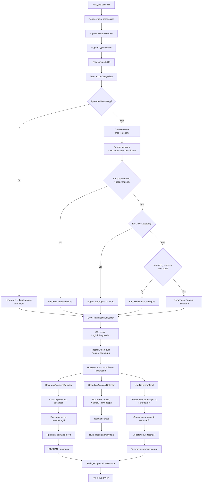

```mermaid
flowchart TD
    A[Загрузка выписки] --> B[Поиск строки заголовков]
    B --> C[Нормализация колонок]
    C --> D[Парсинг дат и сумм]
    D --> E[Извлечение MCC]

    E --> F[TransactionCategorizer]
    F --> F1{Денежный перевод?}
    F1 -- Да --> F2[Категория = Финансовые операции]
    F1 -- Нет --> F3[Определение mcc_category]
    F3 --> F4[Семантическая классификация description]
    F4 --> F5{Категория банка информативна?}
    F5 -- Да --> F6[Берём категорию банка]
    F5 -- Нет --> F7{Есть mcc_category?}
    F7 -- Да --> F8[Берём категорию по MCC]
    F7 -- Нет --> F9{semantic_score >= threshold?}
    F9 -- Да --> F10[Берём semantic_category]
    F9 -- Нет --> F11[Оставляем Прочие операции]

    F2 --> G[OtherTransactionClassifier]
    F6 --> G
    F8 --> G
    F10 --> G
    F11 --> G

    G --> G1[Обучение LogisticRegression]
    G1 --> G2[Предсказание для Прочих операций]
    G2 --> G3[Подмена только confident-категорий]

    G3 --> H[RecurringPaymentDetector]
    H --> H1[Фильтр реальных расходов]
    H1 --> H2[Группировка по merchant_id]
    H2 --> H3[Признаки регулярности]
    H3 --> H4[DBSCAN + правила]

    G3 --> I[SpendingAnomalyDetector]
    I --> I1[Признаки суммы, частоты, календаря]
    I1 --> I2[IsolationForest]
    I2 --> I3[Rule-based anomaly flag]

    G3 --> J[UserBehaviorModel]
    J --> J1[Помесячная агрегация по категориям]
    J1 --> J2[Сравнение с личной медианой]
    J2 --> J3[Аномальные месяцы]
    J3 --> J4[Текстовые рекомендации]

    H4 --> K[SavingsOpportunityEstimator]
    J4 --> K
    K --> L[Итоговый отчёт]
```